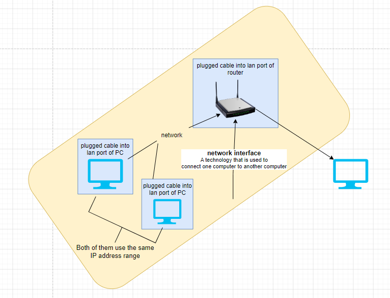

# Networking

Networking is plugging computers with each other and the underlying technology that allow that to happen.

We connect all computers together using a technology call the internet. For internet to work there are some specific technologies and services needed to be in place. We need IP addresses, DNS, routers etc and we need it to all be secure.

## AWS provides all of Network services -

1. Amazon VPC\
   Define and provision an isolated network for your AWS resources
2. AWS Transit Gateway\
   Connect VPCs and on-prem networks
3. AWS Private link\
   Provides private connectivity between VPCs and on-prem applications
4. Amazon Route 53\
   You can host your own managed DNS

### Amazon VPC

Every computer that is linked to another computer via cable, wifi etc requires a network interface to be configured.

A network interface is a bridge between your computer and the technology used to connect to the other computer.

<figure><figcaption></figcaption></figure>

After creating the network, you need to configure it. To configure the network you need to setup an **IP address range** which will be used by yourself and other computers on the same network.

IP address range is kind of a gated community where your computer can only talk to other computers in the same community.

#### IP Address

IPV4 => x.x.x.x

Some reserved IPV4 addresses => 10.0.0.1 | 172.16.0.1 | 192.168.0.1

Amazon VPC lets you create a **virtual network** for your AWS services to exist in a local IP address range.

.png>)

VPC features

* Machines inside VPC want to access Internet => use **NAT Gateway**
* Want Internet to be able to access your EC2 instances => use **Internet Gateway**
* Control which traffic is allowed into and out of your VPC network => **Access Control List (ACL)**

****.png>)****

## Scaling Network&#x20;

1. Elastic Load Balancing\
   Allows you to automatically distribute network traffic across a pool of resources.
2. AWS Global Accelerator

## Content Delivery

1. Amazon Cloudfront\
   Securely deliver data, videos and apps to customers globally with low latency and high speed transfers.
